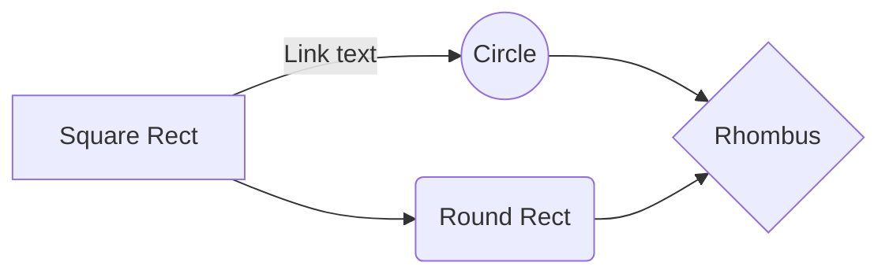

# FactoryApp
App to manage your own farm: from the garden to daily chores
The project aims to be open-source, IoT oriented, low-power, and usable by small to medium businesses.

## Environment tested

    pi@rasphost:~ $ cat /proc/device-tree/model
    Raspberry Pi 3 Model B Rev 1.2pi@rasphost:~ $ cat /etc/debian_version
    9.13
    pi@rasphost:~ $ uname -a 
    Linux rasphost 5.4.47-v7+ #1322 SMP Wed Jun 17 17:52:39 BST 2020 armv7l GNU/Linux
  


## Installation
It has been necessary to format the external memories in ext4 (previously they were in FAT32) because from some researches it has resulted that

> Re: chown not effective on external usb
> 
> Fri Mar 11, 2016 2:54 am chown etc does not work with NTFS or FAT
> formatted drives. The permissions have to be set in FSTAB instead.
> 
> The best solution however would be to format the drive with a Linux
> format EXT4. You will then be able to use chown and you won't be
> dogged by the extra CPU hog ntfs driver.

* Formatting with a new file system:	

```
    root@rasphost:/home/pi# mkfs.ext4 -F -O ^64bit -L "memoria1_64gb" /dev/sda1 
    root@rasphost:/home/pi# mkfs.ext4 -F -O ^64bit -L "memoria2_64gb" /dev/sdb1
```
* Edit the /etc/fstab file to mount in ext4 and under /media/postgres directory (on that directory only postgres user must have access):
```
	nano /etc/fstab
```
```
###########     USB Stick 64 gb memory 1     ###########

UUID=c5761481-2c1e-4eaa-8017-9083e4ac79da       /media/postgres/mem1_64gb       ext4    defaults,rw,users               0       0
```

* Create the data directory to host database on mounted external memory:
```
	root@rasphost:/home/pi# cd /media/postgres/mem1_64gb
	root@rasphost:/media/postgres/mem1_64gb# mkdir factoryapp
	root@rasphost:/media/postgres/mem1_64gb# cd factoryapp
	root@rasphost:/media/postgres/mem1_64gb/factoryapp# mkdir database
```

* Restart raspberry:
```
	root@rasphost:/media/postgres/mem1_64gb/factoryapp# reboot
```

* Install PostgreSQL database management system:

```
	root@rasphost:/home/pi# sudo apt install postgresql postgresql-contrib
```

* Obtain the Postgres cluster status. It should return the location of the log file. 
```
	root@rasphost:/home/pi# pg_lsclusters

	Ver Cluster Port Status Owner    Data directory               Log file
	9.6 main    5432 online postgres /var/lib/postgresql/9.6/main /var/log/postgresql/postgresql-9.6-main.log
```
> **Note:** If the cluster is down or having problems, use the following nano command to view the file:
```
	root@rasphost:/home/pi# nano /var/log/postgresql/postgresql-11-main.log
```

* Once Postgres is working, the following command can be used to access the admin role for the Postgre server:
```
	root@rasphost:/home/pi# su postgres
	postgres@rasphost:/home/pi$ psql
	psql (9.6.24)
	Digit "help" to have an help.

	postgres=#
```

Execute the following **SHOW SQL** command to obtain the location of the **pg_hba.conf** Postgres configuration file on the Raspberry Pi:
```
    postgres=# SHOW hba_file;
                   hba_file
    --------------------------------------
	/etc/postgresql/9.6/main/pg_hba.conf
	(1 riga)
```
             
* Modify the network configuration policy and allowed IP enabled to talk with PostgreSQL:
```
	root@rasphost:/home/pi# nano /etc/postgresql/9.6/main/pg_hba.conf
```

## Change data directory:
* Show current data directory:
```
	postgres=# SHOW data_directory;
	        data_directory        
	------------------------------
	 /var/lib/postgresql/9.6/main
	(1 riga)
```

* Stop the postgres service:
```
	root@rasphost:/home/pi# systemctl stop postgresql
```

* Now that the PostgreSQL server is shut down, we’ll copy the existing database directory to the new location with **rsync**. Using the **-a** flag preserves the permissions and other directory properties, while **-v** provides verbose output so you can follow the progress. We’re going to start the rsync from the postgresql directory in order to mimic the original directory structure in the new location. By creating that postgresql directory within the mount-point directory and retaining ownership by the PostgreSQL user, we can avoid permissions problems for future upgrades.

> **Note:** Be sure there is no trailing slash on the directory, which may be added if you use tab completion. If you do include a trailing slash, rsync will dump the contents of the directory into the mount point instead of copying over the directory itself.*
```
	root@rasphost:/home/pi# rsync -av /var/lib/postgresql /media/pi/mem1_64gb/factoryapp/database
```
* Edit the conf file to change data directory. Find the line that begins with data_directory and change the path which follows to reflect the new location. In the context of this tutorial, the updated directive will look like this:
```
	root@rasphost:/home/pi# vim /etc/postgresql/9.6/main/postgresql.conf
```
```
#------------------------------------------------------------------------------
# FILE LOCATIONS
#------------------------------------------------------------------------------

# The default values of these variables are driven from the -D command-line
# option or PGDATA environment variable, represented here as ConfigDir.

#data_directory = '/var/lib/postgresql/9.6/main'		# use data in another directory
data_directory = '/media/postgres/mem1_64gb/factoryapp/database/postgresql/9.6/main'		# use data in another directory
					# (change requires restart)
hba_file = '/etc/postgresql/9.6/main/pg_hba.conf'	# host-based authentication file
					# (change requires restart)
ident_file = '/etc/postgresql/9.6/main/pg_ident.conf'	# ident configuration file
					# (change requires restart)

# If external_pid_file is not explicitly set, no extra PID file is written.
external_pid_file = '/var/run/postgresql/9.6-main.pid'			# write an extra PID file
					# (change requires restart)
```

* Restart the PostgreSQL service:
```
	root@rasphost:/media/postgres/mem1_64gb# systemctl start postgresql
```

```
	root@rasphost:/media/postgres/mem1_64gb# systemctl status postgresql
	● postgresql.service - PostgreSQL RDBMS
	   Loaded: loaded (/lib/systemd/system/postgresql.service; enabled; vendor preset: enabled)
	   Active: active (exited) since Sun 2022-01-09 18:16:35 CET; 1s ago
	  Process: 21685 ExecStart=/bin/true (code=exited, status=0/SUCCESS)
	 Main PID: 21685 (code=exited, status=0/SUCCESS)

	gen 09 18:16:35 rasphost systemd[1]: Starting PostgreSQL RDBMS...
	gen 09 18:16:35 rasphost systemd[1]: Started PostgreSQL RDBMS.
```

* Verify that data directory is changed:
```
	root@rasphost:/media/postgres/mem1_64gb# su postgres
	postgres@rasphost:/media/postgres/mem1_64gb$ psql
	psql (9.6.24)
	Digita "help" per avere un aiuto.

	postgres=# SHOW data_directory;
	                          data_directory                           
	-------------------------------------------------------------------
	 /media/postgres/mem1_64gb/factoryapp/database/postgresql/9.6/main
	(1 riga)
```


## UML diagrams

You can render UML diagrams using [Mermaid](https://mermaidjs.github.io/). For example, this will produce a sequence diagram:


And this will produce a flow chart:


